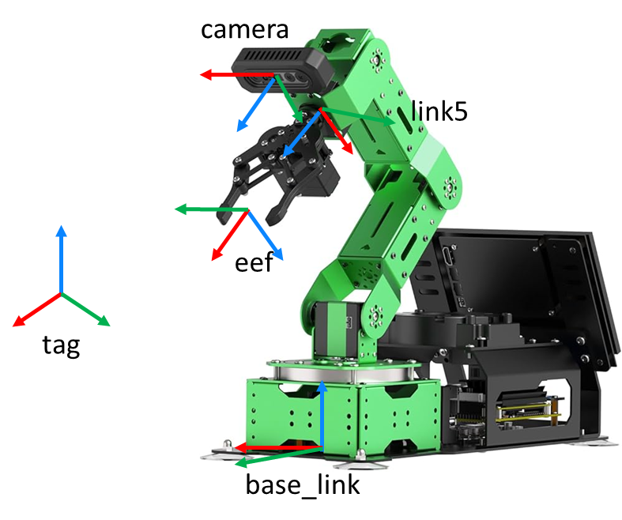

## Homogeneous Transformation Matrix Utilities and Frame Conversion Demo

This script demonstrates how to **construct, invert, and chain homogeneous transformation matrices** using Python, NumPy, and ROS geometry messages. It is commonly used in robotics applications to represent **coordinate frame transformations**, such as camera-to-end-effector or end-effector-to-link transformations.

The example is especially relevant for **robot kinematics, perception-to-manipulation pipelines, and AprilTag-based pose estimation**.

---

## Background: Homogeneous Transformations

A homogeneous transformation matrix represents both **rotation** and **translation** in a single 4×4 matrix:

$$
T =
\begin{bmatrix}
R & t \\
0 & 1
\end{bmatrix}
$$

where:

- $R \in \mathbb{R}^{3 \times 3}$ is a rotation matrix  
- $t \in \mathbb{R}^{3}$ is a translation vector 

Such matrices allow transformations to be **composed using matrix multiplication**.

---

## Function: `T44(R, t)`

```python
def T44(R, t):
```

This function constructs a **4×4 homogeneous transformation matrix** from:

* a 3×3 rotation matrix `R`
* a 3×1 translation vector `t`

### Operation

1. Concatenates the rotation matrix and translation vector horizontally
2. Appends the homogeneous row `[0 0 0 1]`

### Output

$$
T =
\begin{bmatrix}
R & t \\
0 & 1
\end{bmatrix}
$$

---

## Function: `inv_T44(T2)`

```python
def inv_T44(T2):
```

This function computes the **inverse of a homogeneous transformation matrix**.

### Mathematical principle

For a transformation:

$$
T =
\begin{bmatrix}
R & t \\
0 & 1
\end{bmatrix}
$$

The inverse is:

$$
T^{-1} =
\begin{bmatrix}
R^T & -R^T t \\
0 & 1
\end{bmatrix}
$$

### Operation

* Transposes the rotation matrix
* Rotates and negates the translation vector
* Reconstructs the inverse 4×4 matrix

This is essential when converting poses **between coordinate frames**.

---

## Demo 1: Converting a ROS Pose to a Transformation Matrix

The script first demonstrates how to convert a ROS `geometry_msgs/Pose` into a homogeneous transformation matrix.

### Steps

1. Define a `Pose` with position and orientation
2. Extract translation ((x, y, z))
3. Convert quaternion orientation to a rotation matrix using `tf.transformations`
4. Construct the final 4×4 transformation matrix

### Result

This produces a transformation:

$$
{}^{\text{world}}T_{\text{object}}
$$

which describes the pose of an object in a reference frame.

---

## Demo 2: Rotation Matrix from Axis–Angle Representation

The script demonstrates how to generate rotation matrices from **axis–angle rotations**:

```python
tft.rotation_matrix(angle, axis)
```

Example:

* Rotation of −90° about the Z-axis
* Small correction rotation about the X-axis

These rotations are combined using matrix multiplication to form a final rotation matrix.

---

## Demo 3: Camera and End-Effector Poses in `link5` Frame

Two transformations are defined:

### Camera in `link5` frame

$$
{}^{\text{link5}}T_{\text{camera}}
$$

* Rotation: Z-axis and X-axis rotations
* Translation: ([-0.045, 0, 0.02]) meters

### End-Effector in `link5` frame

$$
{}^{\text{link5}}T_{\text{eef}}
$$

* Rotation: −90° about the Y-axis
* Translation: ([0, 0, 0.11054687369]) meters

These transforms are constructed using the `T44` utility.

---

## Demo 4: Computing Camera Pose in End-Effector Frame

To compute the camera pose relative to the end-effector frame, the following operation is performed:

$$
{}^{\text{eef}}T_{\text{camera}} =
\left( {}^{\text{link5}}T_{\text{eef}} \right)^{-1}
\cdot
{}^{\text{link5}}T_{\text{camera}}
$$

This is implemented using:

```python
T_camera_in_eef = np.dot(inv_T44(T_eef_in_link5), T_camera_in_link5)
```

This transformation is crucial for:

* Hand–eye calibration
* Vision-guided manipulation
* Converting camera-detected object poses into robot control frames

---

## Practical Applications

This script supports common robotics tasks such as:

* Camera–end-effector calibration
* AprilTag pose transformation
* Forward and inverse kinematics
* Pick-and-place motion planning
* Frame chaining and coordinate conversion

---

## Summary

This example provides a clear and practical demonstration of:

* Building homogeneous transformation matrices
* Inverting transformations correctly
* Chaining multiple frame transformations
* Converting between ROS poses and matrix representations

These operations form the mathematical backbone of modern robotic perception and manipulation systems.

## Python Code
```
import numpy as np
from geometry_msgs.msg import Pose
import tf.transformations as tft


def T44(R,t):
	T = np.hstack((R, t))  # Combine rotation and translation to the left side
	T = np.vstack((T, np.array([0, 0, 0, 1])))  # Add the bottom row for homogeneous coordinates
	return T
def inv_T44(T2):
	R2_inv = T2[:3, :3].T  # Transpose of the rotation matrix
	t2_inv = -np.dot(R2_inv, T2[:3, 3])  # Negated rotated translation

	# Construct the inverse homogeneous transformation matrix
	T2_inv = np.hstack((R2_inv, t2_inv.reshape(3, 1)))  # Add inverse translation
	T2_inv = np.vstack((T2_inv, np.array([0, 0, 0, 1])))  # Add homogeneous row

	return T2_inv

if __name__ == '__main__':
	# Demo: Pose to T44 Homogenous Transformation Matrix
	p1=Pose()
	p1.position.x=0.1
	p1.position.y=0.1
	p1.position.z=0.1
	p1.orientation.w=1			
	print(p1)
	translation = np.array([p1.position.x, 
	p1.position.y, 
	p1.position.z])

	quaternion = np.array([p1.orientation.x,
	p1.orientation.y,
	p1.orientation.z,
	p1.orientation.w,])

	# Convert quaternion to rotation matrix using tf.transformations
	R = tft.quaternion_matrix(quaternion)[:3, :3]  # Get only the 3x3 rotation matrix part
	# Create the homogeneous transformation matrix
	T = np.eye(4)  # Start with the identity matrix
	T[:3, :3] = R  # Set the rotation part
	T[:3, 3] = translation  # Set the translation part
	
	print(T)	
	
	
	## Demo how to convert rotation angle to rotation matrix
	R_camera_in_link5=np.dot(tft.rotation_matrix(np.radians(-90), [0, 0, 1]) , tft.rotation_matrix(-0.1, [1, 0, 0]))[:3, :3]
	print(R_camera_in_link5)

	P_camera_in_link5=np.array([[-0.045],[0],[0.02]])
	R1=R_camera_in_link5
	t1=P_camera_in_link5
	# T_camera_in_link5
	T_camera_in_link5 = T44(R1,t1)
		
	R_eef_in_link5=tft.rotation_matrix(np.radians(-90), [0, 1, 0])[:3, :3]
	print(R_eef_in_link5)
	P_eef_in_link5=np.array([[0.0],[0.0],[0.11054687369]])
	# Now, let's say we have another transformation T2
	R2 = R_eef_in_link5
	t2 = P_eef_in_link5
	T_eef_in_link5 = T44(R2,t2)


	# Matrix multiplication (homogeneous transformation multiplication)
	T_camera_in_eef = np.dot(inv_T44(T_eef_in_link5), T_camera_in_link5)
	print(T_camera_in_eef)	
```

