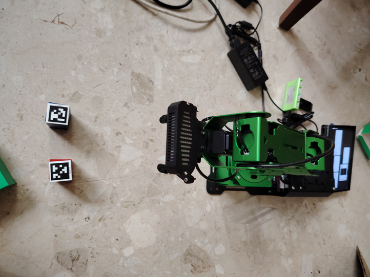

## AprilTag-Based Tag Tracking Node

This Python script implements a **ROS-based AprilTag tracking node** using a monocular RGB camera. The node detects AprilTag markers in the camera image stream, estimates their **6-DoF pose (position and orientation)** relative to the camera frame, and visualizes the results in real time.

This module is designed for the **JetArm robotic platform** and serves as the perception foundation for downstream tasks such as **inverse kinematics (IK), pick-and-place manipulation, and vision-guided control**.

---

## System Overview

The tag tracking node performs the following main functions:

1. Subscribes to a camera image topic
2. Detects AprilTag markers using the `dt_apriltags` library
3. Estimates the pose of each detected tag in the camera frame
4. Visualizes tag boundaries, IDs, and coordinate frames
5. Initializes the robot arm into a predefined safe configuration
---

## AprilTag Detection and Pose Estimation

AprilTag detection is performed using the `dt_apriltags.Detector` with the `tag36h11` family. For each detected tag, the detector outputs:

- A **rotation matrix** describing the orientation of the tag relative to the camera frame:
  
  $$
  {}^{\text{camera}}R_{\text{tag}}
  $$

- A **translation vector** describing the position of the tag relative to the camera frame:
  
  $$
  {}^{\text{camera}}P_{\text{tag}}
  $$

The pose estimation relies on:
- Camera intrinsic parameters $\(f_x, f_y, c_x, c_y\)$
- Known physical tag size (0.025 m)

---

## ROS Node Initialization

When the node starts, it performs the following initialization steps:

- Initializes a ROS node named `tag_tracking_node`
- Creates an AprilTag detector instance with customized detection parameters
- Publishes servo commands to move the JetArm into a predefined initial configuration
- Subscribes to the RGB camera topic (default: `/rgbd_cam/color/image_rect_color`)

This ensures that tag detection begins with the robot in a known and collision-safe pose.

---

## Image Processing Pipeline

For each incoming image, the following processing steps are executed:

1. Convert the ROS `sensor_msgs/Image` message into an OpenCV image
2. Convert the image to grayscale for AprilTag detection
3. Detect AprilTags and estimate their poses
4. Sort detected tags by tag ID
5. Draw tag boundaries and centers on the image
6. Draw the tag coordinate frame axes using OpenCV
7. Display real-time frame rate (FPS) information

---

## Tag Identification Logic

The node distinguishes tags based on their unique IDs:

- Tag ID 1 → Tag 1
- Tag ID 2 → Tag 2
- Tag ID 3 → Tag 3
- Other IDs → Other or unknown tags

This structure allows different tags to be mapped to different objects or manipulation tasks.

---

## Visualization and Debugging

The node visualizes detection results in an OpenCV window:

- Green outlines indicate detected AprilTag boundaries
- RGB axes represent the estimated tag coordinate frame
- FPS information provides performance feedback

This visualization is useful for validating camera calibration, tag pose estimation accuracy, and system performance.

---

## Role in Pick-and-Place Applications

This AprilTag tracking node provides the **perception layer** for pick-and-place tasks:

- The estimated tag pose ${}^{\text{camera}}P_{\text{tag}}$ can be transformed into the robot base frame using forward kinematics and known camera–end-effector calibration.
- The transformed pose can then be used as input to inverse kinematics solvers for grasp planning and motion execution.

---

## Tag Tracking: Testing Experiment Setup
- Attach tag on the long blocks (For example: tag 2 for blue, tag 3 for red)
- Track tag pose with tag_tracking_basic.py 
- Figure out the poses of the object tags


**Figure 1.** JetArm Tag Tracking Setup
## Summary

This script demonstrates a complete and practical implementation of AprilTag-based pose tracking in ROS. It integrates real-time vision processing, pose estimation, and visualization, forming a solid foundation for vision-guided robotic manipulation tasks such as picking and placing objects.

## Python Code
```
#!/usr/bin/env python3
import os
import cv2
import rospy
import numpy as np
from sensor_msgs.msg import Image
from vision_utils import fps, draw_tags
from hiwonder_interfaces.msg import MultiRawIdPosDur
from dt_apriltags import Detector
from jetarm_sdk import bus_servo_control, pid

import rospy
import tf2_ros
import geometry_msgs.msg
import tf.transformations as tft

import tf2_geometry_msgs

class TagTrackingNode:
    def __init__(self):
        rospy.init_node('tag_tracking_node')


        self.at_detector = Detector(searchpath=['apriltags'], 
                                    families='tag36h11',
                                    nthreads=8,
                                    quad_decimate=2.0,
                                    quad_sigma=0.0,
                                    refine_edges=1,
                                    decode_sharpening=0.25,
                                    debug=0)

        self.fps = fps.FPS() # frame rate calculator 
        self.servos_pub = rospy.Publisher('/controllers/multi_id_pos_dur', MultiRawIdPosDur, queue_size=1)
        rospy.sleep(3)
        # robot move to this initial configuration with servo values as assigned
        bus_servo_control.set_servos(self.servos_pub, 1000, ((1, 500), (2, 450), (3, 285), (4, 150), (5, 500), (10, 200)))
        rospy.sleep(2)

        # subscriber camera image topic
        source_image_topic = rospy.get_param('~source_image_topic', '/rgbd_cam/color/image_rect_color')
        rospy.loginfo("Subscribing source image node" + source_image_topic)
        self.image_sub = rospy.Subscriber(source_image_topic, Image, self.image_callback, queue_size=2)
        
    
    def image_callback(self, ros_image):
        #rospy.logdebug('Received an image! ')
        # convert image to opencv format
        rgb_image = np.ndarray(shape=(ros_image.height, ros_image.width, 3), dtype=np.uint8, buffer=ros_image.data)
        result_image = np.copy(rgb_image)
        tags = self.at_detector.detect(cv2.cvtColor(rgb_image, cv2.COLOR_RGB2GRAY), True, [452.533, 452.533, 325.613, 240.352], 0.025)
        #True means tracking pose of tags
        #camera model: [fx,fy,cx,cy] is [452.533, 452.533, 325.613, 240.352]. You should replace this value based on your camera calibration data.
        tags = sorted(tags, key=lambda tag: tag.tag_id) # sorted
        draw_tags(result_image, tags, corners_color=(0, 0, 255), center_color=(0, 255, 0))
        
        # Example usage with flexible frame names
        R0=[]
        P0=[]
        camera_matrix = np.array([[452.533, 0, 325.613],
                                  [0, 452.533, 240.352],
                                  [0, 0, 1]], dtype=np.float32)

        dist_coeffs = np.zeros((4, 1))  # Assuming no distortion
        tag_size = 0.025  # in meters
                
        if len(tags) > 0:
            for tag in tags:
                if tag.tag_id == 1:
                    print('I am tag1')
                elif tag.tag_id == 2:
                    print('I am tag2')
                elif tag.tag_id == 3:
                    print('I am tag3')
                else:
                    print('I am other tags')
                    
                print(tag.pose_R)# Orientation in camera frame
                print(tag.pose_t)# Position in camera frame
                
                R0=tag.pose_R
                P0=tag.pose_t
                
                corners = tag.corners
                # Draw the detected tag's corners
                result_image = cv2.polylines(result_image, [np.int32(corners)], isClosed=True, color=(0, 255, 0), thickness=2)
                # Draw the coordinate frame (axes) on the tag
                cv2.drawFrameAxes(result_image, camera_matrix, dist_coeffs, R0, P0, 0.025)  # 0.025 is the length of the axes in meters


        self.fps.update()
        self.fps.show_fps(result_image)
        result_image = cv2.cvtColor(result_image, cv2.COLOR_RGB2BGR)
        cv2.imshow("tag_tracking_poses", result_image)
        key = cv2.waitKey(1)


if __name__ == '__main__':
    try:
        tag_tracking = TagTrackingNode()
        rospy.spin()
    except Exception as e:
        rospy.logerr(str(e))
```
